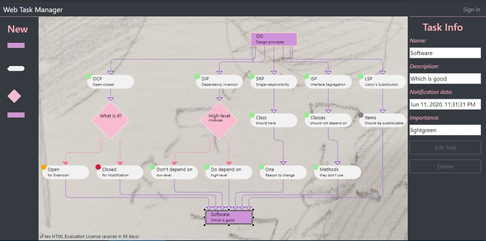

# Web Task Manager

A project that has been done during my internship at Netcracker

It visualizes such entities as tasks. They have importance status, expiration date and etc. Pretty much as daily tasks.

The license for yfiles for HTML has expired. But I have a screenshot of how it was:

